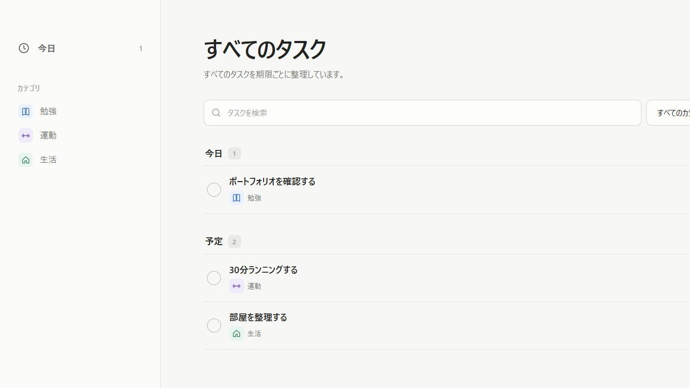
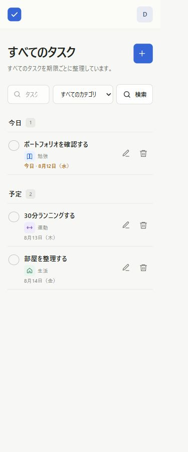

# TodoApp

期限とカテゴリで予定を整理し、「今日やること」に集中できる個人向けタスク管理Webアプリです。

単純なタスク登録だけでなく、ユーザー認証、ユーザーごとのデータ分離、検索・絞り込み、CSRF対策、自動テスト、レスポンシブデザインまで実装しました。



<p align="center">
  
</p>

## デモ

- 公開URL：デプロイ完了後に追記
- ユーザー名：`demo_user`
- パスワード：`portfolio123`

デモ環境のアカウントとデータは動作確認専用です。個人情報や重要な内容は入力しないでください。無料公開環境の再起動時に、データが初期状態へ戻る場合があります。

## 制作背景

既存のTodoアプリは機能が増えるほど、画面内の情報も増えて操作が迷いやすくなります。そこで本作品では、必要な機能を保ちながら画面を整理し、「追加・完了・編集・削除」の操作が直感的に伝わることを重視しました。

実際にアプリを使いながら、押せる範囲が分かりにくい、通知が残り続ける、項目が多すぎるといった問題を一つずつ見つけ、UIと処理の両方を改善しています。

## 主な機能

### アカウント

- 新規登録・ログイン・ログアウト
- パスワードのハッシュ化
- ユーザーごとのタスクデータ分離
- ログインしていない利用者のアクセス制御

### タスク管理

- タスクの追加・編集・完了切り替え・削除
- 期限による「期限切れ・今日・予定・完了」のグループ表示
- 完了したタスクを一覧に残したまま確認
- 「勉強・運動・生活」のカテゴリ分類
- キーワード検索とカテゴリ絞り込み
- 削除前の確認ダイアログ
- 操作結果を伝える自動消去通知

### UI / UX

- PC・タブレット・スマートフォン対応
- カテゴリごとに意味が伝わるアイコンと配色
- 編集ボタンを押した場合だけ編集画面を表示
- タスク追加欄の外側クリック・Escキーによる閉じる操作
- キーボード操作とフォーカス表示
- スクリーンリーダー向けラベル
- 動きを減らすOS設定への対応

## 使用技術

| 分類 | 技術 |
| --- | --- |
| バックエンド | Python 3.13 / Flask 3.1 |
| データベース | SQLite |
| フロントエンド | Jinja2 / HTML / CSS / Vanilla JavaScript |
| 認証・安全性 | Werkzeug password hashing / CSRF token / Security headers |
| テスト・CI | unittest / GitHub Actions |
| 本番実行 | Gunicorn / Render |

## 工夫した点

### 1. 操作の目的を明確にしたUI

タスク行全体を編集ボタンにせず、鉛筆アイコンを押した場合だけ編集画面が開く設計にしました。完了・編集・削除の操作範囲を分けることで、誤操作を防いでいます。

### 2. 情報量を減らし、優先順位を整理

利用時に重要度が低かった進捗カード、日付、並べ替え、優先度入力などを見直しました。タスク名・カテゴリ・期限を中心に配置し、画面を見た瞬間に予定を把握できる構成にしています。

### 3. ユーザー単位の認可

タスクIDだけで更新・削除せず、すべてのタスク操作で`task_id`と`user_id`を同時に照合しています。他の利用者がURLを書き換えても、別ユーザーのタスクを操作できません。

### 4. 安全なフォーム処理

POSTリクエストにCSRFトークンを付与し、サーバー側でもタスク名、期限、カテゴリを検証しています。SQLはプレースホルダーを利用し、テンプレートでは入力内容を自動エスケープしています。

### 5. 保守しやすい構成

画面遷移と入力検証を`app.py`、データベース操作を`database.py`へ分離しました。`create_app()`を採用し、テストごとに専用DBと設定を差し替えられます。

## 苦労した点と改善

- 完了後のタスクが画面から消える問題を、表示条件と並び順の見直しで改善
- 編集項目を削除した際にJavaScriptが古い項目を参照して開けなくなった問題を修正
- タスク行全体が編集操作になっていた状態を、編集ボタン限定の動作へ変更
- 追加フォームが閉じにくい問題を、外側クリックとEscキー対応で改善
- カテゴリ名の変更時に、既存データも失わない移行処理を実装
- PCとスマートフォンで同じ操作ができるよう、画面幅ごとのレイアウトを調整

これらの改善を通して、見た目だけでなく、状態管理・データ移行・入力検証まで含めて品質を高めました。

## セキュリティ対策

- パスワードのハッシュ化
- CSRF対策
- ユーザーごとの認可チェック
- SQLプレースホルダー
- XSSを防ぐテンプレートエスケープ
- Cookieの`HttpOnly`・`SameSite`設定
- CSP、クリックジャッキング防止などのセキュリティヘッダー
- 外部URLへの不正なリダイレクト防止

## 自動テスト

次の項目を自動テストしています。

- 登録・ログイン・ログアウト
- タスクの追加・編集・完了・削除
- 入力値の検証
- 検索・カテゴリ・表示範囲
- ユーザー間のデータ分離
- CSRF・XSS・セキュリティヘッダー
- 不正なURLと存在しないタスクの処理
- 公開環境のヘルスチェック

```powershell
python -m unittest discover -s tests -v
```

## ローカルで起動する方法

```powershell
git clone https://github.com/kaito-dev576/flask-todo-app.git
cd flask-todo-app
python -m venv .venv
.\.venv\Scripts\Activate.ps1
python -m pip install -r requirements.txt
$env:SECRET_KEY = "十分に長いランダムな文字列"
python app.py
```

ブラウザで`http://127.0.0.1:5000`を開きます。

## 構成

```text
flask-todo-app/
├─ app.py                  # ルーティング・認証・入力検証
├─ database.py             # SQLite操作・テーブル初期化
├─ templates/              # Jinja2テンプレート
├─ static/                 # CSS・JavaScript
├─ tests/                  # 自動テスト
├─ docs/                   # README用画像
├─ .github/workflows/      # GitHub Actions
├─ render.yaml             # Web公開設定
└─ requirements.txt
```

## 今後の改善案

- SQLiteからPostgreSQLへの移行
- パスワード再設定・メール認証
- 利用者によるカテゴリの追加・編集
- Playwrightなどを使ったE2Eテスト
- ページネーション
